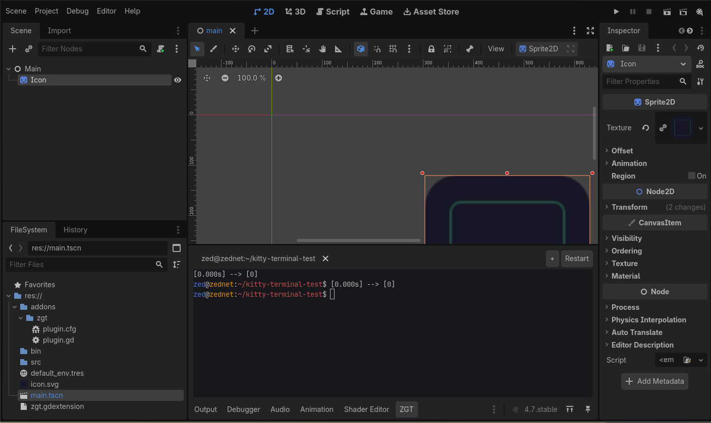
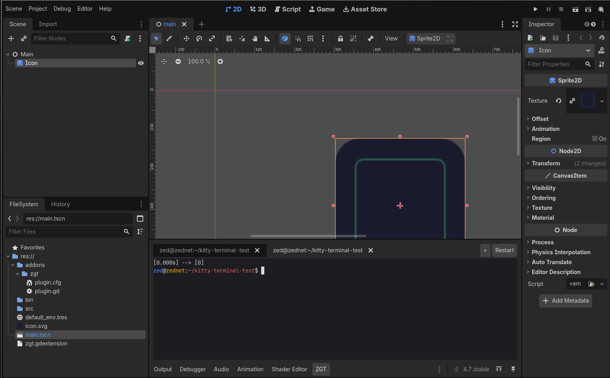
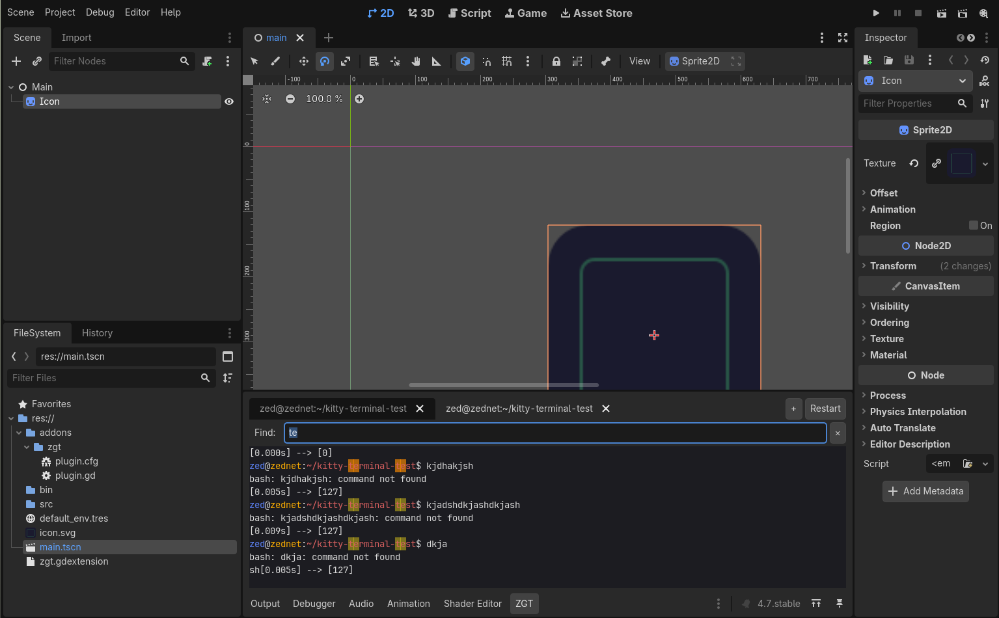
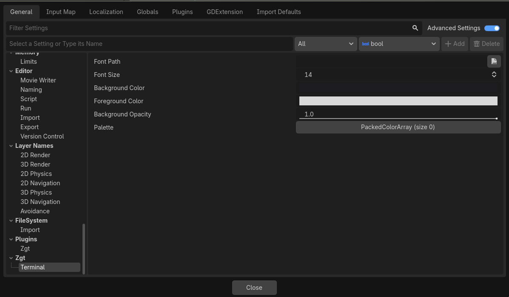

# ZGT — ZeDs Godot Terminal

A Godot 4 GDExtension (C++) that adds a real, built-in terminal to the editor's bottom panel. It runs your shell (`$SHELL`) on a pseudoterminal and renders the character grid itself, so it works identically on **X11 and Wayland** — no window embedding. Good enough to run full TUIs like `claude`, `nvim`, `htop` and `lazygit`.

 



## Highlights

- **Real PTY shell** — `$SHELL -i` with `TERM=xterm-256color`, truecolor, alt-screen, bracketed paste. Starts **inside your project** (`res://`).
- **Multiple terminals in tabs** — `+` to open more sessions; each tab shows its window title.
- **Mouse support** — clicks/drag/scroll forwarded to TUIs (SGR mouse `?1006`); hold **Shift** for the terminal's own text selection.
- **Scrollback search** — `Ctrl+Shift+F`, with highlighted matches and next/prev.
- **Smart selection & links** — double-click a word, triple-click a line, **Ctrl+click** a URL to open it.
- **Configurable** — font, size, colors and a 16-color palette via Project Settings; live font zoom with `Ctrl+Shift+=/-`.
- **Themed cursor** — block / underline / bar (DECSCUSR), OSC 52 clipboard, focus reporting.

| Tabs | Scrollback search | Configuration |
|---|---|---|
|  |  |  |

## Install

1. **Download** the latest archive from the [Releases](https://github.com/zednaked/zgt-bin/releases) page (or clone this repo).
2. **Copy** `addons/`, `bin/` and `zgt.gdextension` into your Godot project root:
   ```
   your-project/
   ├── addons/zgt/{plugin.cfg, plugin.gd}
   ├── bin/libzgt.linux.template_debug.x86_64.so
   └── zgt.gdextension
   ```
3. **Enable** the plugin: **Project → Project Settings → Plugins → ZeDs Godot Terminal → Enabled**.

The **ZGT** tab appears in the bottom panel. A **Nerd Font** (e.g. JetBrains Mono Nerd Font) is recommended so box-drawing and icon glyphs render perfectly.

### Choosing the right binary

| File | When to use |
|---|---|
| `libzgt.linux.template_debug.x86_64.so` | Editor builds — use this in almost all cases |
| `libzgt.linux.template_release.x86_64.so` | Export templates — only needed if you export your project |

Drop both in `bin/`; Godot picks the right one automatically.

## Usage

| Action | Shortcut |
|---|---|
| Copy selection / paste | `Ctrl+Shift+C` / `Ctrl+Shift+V` (or middle-click) |
| Select word / line | double-click / triple-click |
| Open URL | `Ctrl+click` |
| Search scrollback | `Ctrl+Shift+F` (Enter: next · Shift+Enter: prev · Esc: close) |
| Zoom font | `Ctrl+Shift+=` / `Ctrl+Shift+-` / `Ctrl+Shift+0` |
| New terminal / close tab | `+` button / `✕` on the tab |
| Scroll history | mouse wheel (primary screen) |

When a TUI grabs the mouse, clicks/scroll go to the app — **hold Shift** to select text instead.

## Configuration

Under **Project Settings → General → `zgt/terminal`**:

| Setting | Description |
|---|---|
| `font_path` | a `.ttf`/`.otf` to use (empty = bundled Nerd Font default) |
| `font_size` | initial size (6–48) |
| `background_color` / `foreground_color` | default colors |
| `background_opacity` | 0–1 (translucent background) |
| `palette` | optional 16-color ANSI palette override |

Click **Restart** on the panel to apply.

## Requirements

- **Godot 4.2+** (works on 4.3–4.7+)
- **Linux** (x86_64) — uses `forkpty`
- No X11/Wayland dependencies

## Troubleshooting

| Symptom | Likely cause |
|---|---|
| **ZGT tab doesn't appear** | Plugin not enabled, or `.so` missing from `bin/` |
| **"Failed to load GDExtension"** | `zgt.gdextension` missing or wrong path |
| **Editor crashes on startup with a Vulkan error** | Your GPU's Vulkan driver, **not ZGT** — install it (e.g. `vulkan-intel`) or launch with `--rendering-driver opengl3` |
| **Boxes/icons look broken** | Install a Nerd Font, or set `zgt/terminal/font_path` |
| **No color** | `TERM` not `xterm-256color` |

Source code: https://github.com/zednaked/zgt
